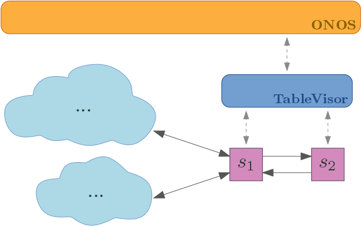
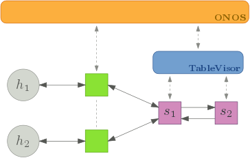

# Example 1: MPLS_PUSH in a Staged Pipeline

Example 1 is designed to be simple but still provide an idea of TableVisor's capabilities.
An overview of the scenario is presented in the following picture.



Assume we are operating a switch `s1` that is forwarding traffic based on an existing MPLS label, but it is unable to push an MPLS header to regular IPv4 packets.
We would like to enhance its capabilities by adding another device `s2` into the pipeline, pushing and setting MPLS labels based on the `ETH_DST` field.
In this simple scenario, only 2 ports of `s1` are in use (excluding our pipeline), while messages with `label=1` are forwarded to port `1`, and `label=2` is forwarded to port `2`.

## Setup

The actual setup of this example is presented in the following picture.



Both parts of the remaining network are represented by a single host.
The additional green switches were added to remove the MPLS header from incoming packets, so the hosts can actually read incoming packets.
They are not subject of the example itself.

For both switches `s1` and `s2`, we are only using their respective table `0`.
`s1.table0` is mapped to global tables `0` and `2`, while `s2.table0` is mapped to table `1`.
The following flow rules are pushed into the aggregated TableVisor switch:

| Global Table    | Local Table    | Match                              | Actions                                      | Priority |
| --------------- | -------------  | ---------------------------------- | -------------------------------------------- | -------- |
| `0`             | `s1.table0`    | `ETH_TYPE=ipv4`                    | `GOTO_TABLE 1`                               | 10       |
| `0`             | `s1.table0`    | `ETH_TYPE=mpls` and `MPLS_LABEL=1` | `OUTPUT PORT=1`                              | 10       |
| `0`             | `s1.table0`    | `ETH_TYPE=mpls` and `MPLS_LABEL=2` | `OUTPUT PORT=2`                              | 10       |
| `1`             | `s2.table0`    | `ETH_TYPE=ipv4` and `ETH_DST=h1`   | `MPLS_PUSH`, `LABEL=1`, `GOTO_TABLE 2`       | 10       |
| `1`             | `s2.table0`    | `ETH_TYPE=ipv4` and `ETH_DST=h2`   | `MPLS_PUSH`, `LABEL=2`, `GOTO_TABLE 2`       | 10       |
| `2`             | `s1.table0`    | `ETH_TYPE=ipv4`                    | `OUTPOT PORT=CONTROLLER`                     | 15       |

Note that the priority of the rule in table `2` is higher than the priorities in table `0`, as they share the same destination.
TableVisor transforms the rules into the following flows, as it passes the FlowMods to the devices:

| Switch          | Table ID       | Match                              | Actions                                      | Priority |
| --------------- | -------------  | ---------------------------------- | -------------------------------------------- | -------- |
| `s1`            | `0`            | `ETH_TYPE=ipv4`                    | `OUTPUT PORT=3`                              | 10       |
| `s1`            | `0`            | `ETH_TYPE=mpls` and `MPLS_LABEL=1` | `OUTPUT PORT=1`                              | 10       |
| `s1`            | `0`            | `ETH_TYPE=mpls` and `MPLS_LABEL=2` | `OUTPUT PORT=2`                              | 10       |
| `s1`            | `0`            | `ETH_TYPE=ipv4` and `IN_PORT=4`    | `OUTPOT PORT=CONTROLLER`                     | 15       |

| Switch          | Table ID       | Match                              | Actions                                      | Priority |
| --------------- | -------------  | ---------------------------------- | -------------------------------------------- | -------- |
| `s2`            | `0`            | `ETH_TYPE=ipv4` and `ETH_DST=h1`   | `MPLS_PUSH`, `LABEL=1`, `OUTPUT PORT=2`      | 10       |
| `s2`            | `0`            | `ETH_TYPE=ipv4` and `ETH_DST=h2`   | `MPLS_PUSH`, `LABEL=2`, `OUTPUT PORT=2`      | 10       |

Note that every `GOTO_TABLE` instruction that leads to another device is transformed into the corresponding `OUTPUT` instruction, while flows in the last table also receive an additional `IN_PORT=4` match.
This allows IPv4 communication between `h1` and `h2`, which will be tested with simple pings further below.

In order to work in the mininet environment, ARP requests must also be processed and answered.
In this setup, they are handled by a dedicated set of (default) ONOS apps, which install some further default rules into table `0`, forwarding various types of non-IPv4 traffic to the controller and handling ARP replies on the controller side.

## Execution

In order to execute the example, Mininet, the ONOS controller, and Curl are required next to TableVisor.
However, they do not have to be installed on the same machine.
Note that you need an ONOS version of 1.11.1 or higher, as earlier versions had problems with specifying the correct `ETH_TYPE` with `MPLS_POP` actions through the REST API.

### Adjustments in the Configuration

**You may skip this section if everything (TableVisor, Mininet and ONOS) is running on the same machine.**

In order to connect all parts, the correct IP adresses must be entered in the configuration files.

In the file [example1/topology.py](topology.py), in the following section:

```python
    # Add two controllers:
    # - c_onos is connected directly to ONOS (6653)
    # - c_tv is connected to our TableVisor instance (6654)
    c_onos = net.addController("c1", controller=RemoteController, ip="127.0.0.1", port=6653)
    c_tv = net.addController("c2", controller=RemoteController, ip="127.0.0.1", port=6654)
```

... check the IPs of both controllers.
`c_onos` must point to the machine that hosts the ONOS controller, and `c_tv` must point to the TableVisor machine.

In the file [example1/TVconfig.yml](TVconfig.yml):

```YAML
# Connection from TV to the Controller
upperLayerEndpoints:
  - name: OnosEndpoint
    type: OPENFLOW            # upperlayer.UpperLayerType
    ip: 127.0.0.1
    port: 6653
    reconnectInterval: 5000   # default: 10000 ms
```

... adjust the `ip` such that TableVisor is able to connect to the ONOS instance.

### Startup Commands

#### ONOS

Assuming ONOS was unpacked into the folder `./onos-1.11.1`, execute the following command:

```Shell
./onos-1.11.1/bin/onos-service start
```

ONOS should initialize and present its own terminal.
If no errors occur, you can access its web interface via `http://127.0.0.1:8181/onos/ui/login.html` to test whether it's running properly.
Log in with the user `onos` and password `rocks` and open the Applications settings (click on the three bars in the top left).
Here, enable the **OpenFlow Provider Suite** _(org.onosproject.openflow)_ and the **Proxy ARP/NDP** _(org.onosproject.proxyarp)_ Applications.
Therefor, select them and click on the Play-Button in the top right of the screen.

#### TableVisor

When located in the main repository folder, after compiling TableVisor via `mvn package`, run the following command:

```Shell
java -jar target/tablevisor-standalone-3.0.0-SNAPSHOT-jar-with-dependencies.jar example1/TVconfig.yml
```

The output should look as follows:

```
2017-09-29 15:59:44,784 [main] INFO  - Using configuration file /home/alex/w/17/tablevisor-github/example1/TVconfig.yml
2017-09-29 15:59:44,853 [main] INFO  - Starting TableVisor
2017-09-29 15:59:44,854 [main] INFO  - Initializing ControllerLogApplication...
2017-09-29 15:59:44,854 [main] INFO  - Initializing MultiSwitchApplication...
2017-09-29 15:59:44,855 [main] INFO  - Initializing SwitchLogApplication...
2017-09-29 15:59:44,856 [main] INFO  - Waiting for all (2) switches to connect...
2017-09-29 15:59:44,892 [Thread-1] INFO  - OpenFlowSwitches - Listening for OpenFlow connections on port 6654
```

TableVisor now waits for all switches to connect before communicating with the controller.

#### Mininet

If Mininet was installed properly (e.g., via the package manager of your Linux distribution), it should be accessable through its python API.
In order to start our Mininet topology, simply execute the provided python script [example1/topology.py](topology.py):

```Shell
sudo python ./example1/topology.py
```

Mininet should start with the following output:

```
*** Configuring hosts
h1 h2 
*** Starting CLI:
mininet>
```

You can check whether the correct topology was loaded with the `net` command:

```
mininet> net
h1 h1-eth0:s_h1-eth1
h2 h2-eth0:s_h2-eth1
s_h1 lo:  s_h1-eth1:h1-eth0 s_h1-eth2:s_p1-eth1
s_h2 lo:  s_h2-eth1:h2-eth0 s_h2-eth2:s_p1-eth2
s_p1 lo:  s_p1-eth1:s_h1-eth2 s_p1-eth2:s_h2-eth2 s_p1-eth3:s_p2-eth1 s_p1-eth4:s_p2-eth2
s_p2 lo:  s_p2-eth1:s_p1-eth3 s_p2-eth2:s_p1-eth4
c1
c2
mininet> 
```

Here, `s_h1` and `s_h2` are the additional, stand-alone switches added for MPLS unboxing (green in the above figures).
`s_p1` and `s_p2` are the two purple switches in the TableVisor pipeline.
At this point, you should be able to observe exchanged OpenFlow messages between ONOS and the switches `s_p1` and `s_p2` in the TableVisor terminal.

At any time, you can check the flow table entries of the switches with the command `dpctl dump-flows -O OpenFlow13`:

```
mininet> dpctl dump-flows -O OpenFlow13
*** s_h1 ------------------------------------------------------------------------
OFPST_FLOW reply (OF1.3) (xid=0x2):
 cookie=0x100007a585b6f, duration=22.301s, table=0, n_packets=202, n_bytes=16362, send_flow_rem priority=40000,dl_type=0x8942 actions=CONTROLLER:65535,clear_actions
 cookie=0x100009465555a, duration=22.301s, table=0, n_packets=202, n_bytes=16362, send_flow_rem priority=40000,dl_type=0x88cc actions=CONTROLLER:65535,clear_actions
 cookie=0x10000ea6f4b8e, duration=22.297s, table=0, n_packets=0, n_bytes=0, send_flow_rem priority=40000,arp actions=CONTROLLER:65535,clear_actions
*** s_h2 ------------------------------------------------------------------------
OFPST_FLOW reply (OF1.3) (xid=0x2):
 cookie=0x1000002bbd8d4, duration=22.308s, table=0, n_packets=202, n_bytes=16362, send_flow_rem priority=40000,dl_type=0x88cc actions=CONTROLLER:65535,clear_actions
 cookie=0x10000dc56d70b, duration=22.309s, table=0, n_packets=202, n_bytes=16362, send_flow_rem priority=40000,dl_type=0x8942 actions=CONTROLLER:65535,clear_actions
 cookie=0x10000c70edd85, duration=22.309s, table=0, n_packets=0, n_bytes=0, send_flow_rem priority=40000,arp actions=CONTROLLER:65535,clear_actions
*** s_p1 ------------------------------------------------------------------------
OFPST_FLOW reply (OF1.3) (xid=0x2):
 cookie=0x10000b43cfaaa, duration=17.474s, table=0, n_packets=0, n_bytes=0, send_flow_rem priority=40000,arp actions=CONTROLLER:65535,clear_actions
 cookie=0x1000021cf0883, duration=17.473s, table=0, n_packets=404, n_bytes=32724, send_flow_rem priority=40000,dl_type=0x88cc actions=CONTROLLER:65535,clear_actions
 cookie=0x10000513b0df1, duration=17.471s, table=0, n_packets=404, n_bytes=32724, send_flow_rem priority=40000,dl_type=0x8942 actions=CONTROLLER:65535,clear_actions
*** s_p2 ------------------------------------------------------------------------
OFPST_FLOW reply (OF1.3) (xid=0x2):
mininet> 
```

Here, ONOS already installed its default flow rules from the OpenFlow base applications.
Note that `s_p1` and `s_p2` are behind the TableVisor proxy layer and seen as a single switch, hence `s_p2` does not contain the rules.

You can already check for connectivity via `h1 ping h2`, however, at this point, nothing should happen.

```
mininet> h1 ping h2
PING 10.0.0.2 (10.0.0.2) 56(84) bytes of data.

```

#### Pushing the Flow Rules

Again, while located in the main folder, execute the following command to install the flow rules from the Setup section:

```Shell
curl -u onos:rocks -H 'Content-type: application/json' -X POST -d '@example1/onosRules.json' 'http://127.0.0.1:8181/onos/v1/flows'
```

Note that you may have to adjust the IP address again.

Now, the pings should be properly forwarded in the network and can be observed in the Mininet console.
You can also observe the matching statistics in the ONOS web interface (in the Devices section, select `of:1111111111111111` and click on the flow view icon in the top right).
You can also observe the previously mentioned differences between the flow rules in the ONOS interface and in Mininet via the `dpctl` command.

#### Closing Remarks

In this example, the TableVisor proxy layer was used to enhance the capabilities of the switch `s_p1` by providing another table with `MPLS_PUSH` features.
IPv4 packets arrive at `s_p1`, receive an MPLS header and a label based on their `ETH_DST` field, and leave as MPLS boxed packets towards their destination.
This extension was achieved with minimal operational overhead (configuration of TableVisor via [TVconfig.yml](TVconfig.yml)).